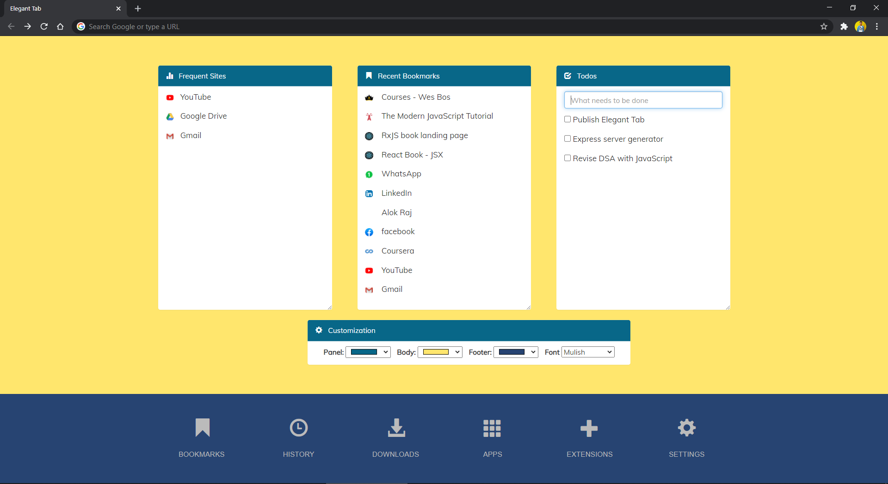

<h1 align="center">welcome to elegant tab 👋</h1>

  
  
  

> A google chrome extension that replaces the existing new tab with a more useful and feature-rich extension.

## 📸 screenshot

## ❓ what is it?

A Google Chrome extension that replaces the existing new tab with a more useful and feature-rich extension.

## 🤔 why elegant tab?

+ Useful shortcuts in the dock (Like that of Firefox)
+ Visit the Most frequent sites with ease
+ A built-in simple Todos manager 
+ Change colors as your eye pleases
+ Very Lightweight

## 📜 usage

+ Step 1: git clone `https://github.com/alok722/elegant-tab.git`
+ Step 2: open `chrome://extensions` in google chrome,
+ Step 3: enable developer mode,
+ Step 4: click on Load Unpacked and select `app` folder of this repository.
+ Step 5: extension is installed and active now, Enjoy !!!
+ to see detailed steps along with picture, click [here]('https://webkul.com/blog/how-to-install-the-unpacked-extension-in-chrome/')

## 👤 author

 **Alok Raj (alokr417@gmail.com)**

* website: https://alokraj.tech/
* github: [@alok722](https://github.com/alok722)

## 🚀 future scope

* adding more widgets
* adding background images
* show weathers status

## 🤝 contributing

contributions, issues and feature requests are welcome! feel free to check [issues page](https://github.com/alok722/elegant-tab/issues).

## 🙌 show your support

give a ⭐️ if you liked this!

## 📝 license

copyright © 2020 [GNU v3.0](https://github.com/alok722/elegant-tab/blob/master/LICENSE)

## 🙏 thank you note!
This extension is an upgraded version of [Perfect New Tab](https://chrome.google.com/webstore/detail/perfect-new-tab/ljiklnmddpaoonnaoocaolnmpfcohjkn). The author of Perfect New Tab is [Ankit Gaurav](https://github.com/theankitgaurav). I am thankful for this simple and clean extension 

***
